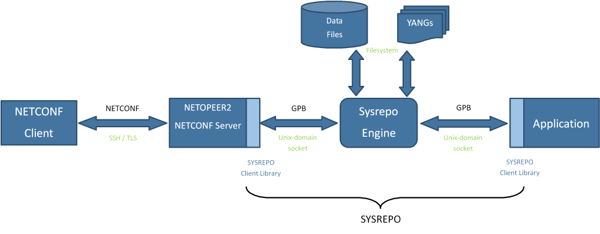

## Sysrepo
Sysrepo is an [YANG](http://tools.ietf.org/html/rfc6020)-based configuration datastore for Unix/Linux applications. 

Applications can use sysrepo to store their configuration modeled by provided YANG model instead of using e.g. flat configuration files. Sysrepo will ensure data consistency of the data stored in the datastore and enforce data constraints defined by YANG model. Applications can currently use [C language API](inc/sysrepo.h) of sysrepo Client Library to access the configuration in the datastore, but the support for other programming languages is planed for later too (since sysrepo uses [Google Protol Buffers](https://developers.google.com/protocol-buffers/) as the interface between the datastore and client library, writing of a native client library for any programing language that supports GPB is possible).

Sysrepo can be easily integrated to management agents such as [NETCONF](https://tools.ietf.org/html/rfc6241) or [RESTCONF](https://tools.ietf.org/html/draft-ietf-netconf-restconf) servers, using the same client library API that applications use to access their configuration. As of now, integration to [Netopeer 2 NETCONF server](https://github.com/CESNET/Netopeer2) is in progress. This way, applications that use sysrepo to store their configuration will automatically benefit from ability to control the application via NETCONF.

## Status
- March 2016: syrepo daemon and data manipulation (edit-config) functionality ready, working on full concurrency and locking support
- February 2016: working on sysrepo daemon, data manipulation (edit-config) functionality
- January 2016: data retrieval (get-config) functionality ready, released as sysrepo [version 0.1.0](https://github.com/sysrepo/sysrepo/releases/tag/v0.1.0)
- December 2015: implementation started - building internal infrastructure, data retrieval (get-config) functionality

## Features
- ability to store / retrieve YANG-modeled data elements adressed by XPath
- startup and running configuration datastore with implicit candidate capability
- data consistency and constraints enforecment according to YANG model (with help of [libyang](https://github.com/cesnet/libyang) library)
- no single point of failure design (client library is able to instantiate its own sysrepo engine and prerform most of the data-access operations also by itself, whithout the need of contacting system-wide daemon)
- (TODO) full transaction and concurrency support, conforming all ACID properties (Atomicity, Consistency, Isolation, Durability)
- (TODO) notifications of subscribed applications about the changes made in the datastore
- (TODO) ability to subscribe to notifications as a verifier and validate the changes before they are committed
- (TODO) plugins infrastructure for applications / services that cannot use sysrepo as the datastoren, but still want to be manageable via sysrepo
- (TODO) operational data support (publishing of application's state data to sysrepo)
- (TODO) [NACM](https://tools.ietf.org/html/rfc6536) (NETCONF Access Control Model)
- (TODO) custom RPC support
- (TODO) [NETCONF Event Notifications](https://tools.ietf.org/html/rfc5277) support
- (TODO) bindings / native client libraries for other programming languages (Python, Java, ...)

## Performance
According to our measurements using the [performance unit-test](tests/perf_test.c) and [concurrency unit-test](tests/concurr_test.c), sysrepo is able to handle more than 100 000 of requests per second (100 requests per millisecond) by concurrent access and about a half of it by sequential access on a conventional laptop hardware (read operations sent in-parallel from multiple sessions / sequentially within a single session).

## Build & Installation Steps
See [INSTALL.md](INSTALL.md) file, which contains detailed build and installation steps.

## Usage Examples
See [examples](examples) directory, which contains an example per each data-acess API function.

Also see our [fork of dnsmasq](https://github.com/sysrepo/dnsmasq-sysrepo) that uses sysrepo to store its configuration for short demonstration of how sysrepo can be integrated into an existing application ([see the diff](https://github.com/sysrepo/dnsmasq-sysrepo/commit/39ce80b6eae1d155af3b20f195c1e13efbc9094a)).

## Documentation
Client Library API, as well as all internal modules of sysrepo are documented with Doxygen comments. To read the documentation, you can navigate to the [nigthly build of documentation on sysrepo.org](http://www.sysrepo.org/static/doc/html/), or [build your own copy](INSTALL.md) of the documentation.

## Other Resources
- [Sysrepo Project WIKI](http://www.sysrepo.org/)
- CESNET's [libyang](https://github.com/cesnet/libyang) YANG toolkit
- CESNET's [Netopeer 2](https://github.com/CESNET/Netopeer2) NETCONF Toolset
- [RFC 6020](http://tools.ietf.org/html/rfc6020) (YANG Data Modeling Language)
- [RFC 6241](https://tools.ietf.org/html/rfc6241) (Network Configuration Protocol - NETCONF)
